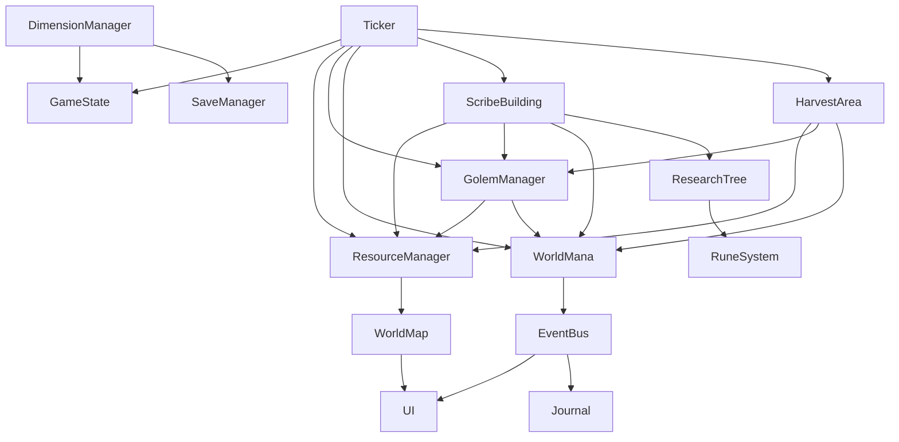

# INCREMAGIC — Master Design Document
> Verbindliche Übersicht. Details → `/specs/`. Jeder Agent liest dies zuerst.
> **Deployment:** Statische Web-App → GitHub Pages. Kein Server. Alles läuft im Browser.

---

## 1. Vision

Römerzeit-Magier, in eine Taschendimension verbannt. Du erschaffst Golems, schickst sie mit schriftlichen Aufträgen los — sie plündern die Welt für dich. Das Spiel ist ein **Optimierspiel**: Produktionsraten basieren auf Wurzeln von Primzahlen, es gibt keine perfekte Lösung. Die Welt hat endlich Magie. Wenn sie erschöpft ist, wechselst du die Dimension — und hinterlässt die Ruinen deiner Gier.

**Metanarrative:** Der Spieler *ist* das Monster. Man merkt es erst, wenn man in einer neuen Welt auf eigene Golems aus alten Runs trifft.

---

## 2. Kern-Mechaniken

**Golems** ernten Ressourcen (wandern immer weiter) oder produzieren (verbrauchen Ressourcen).
**Erntegebiete:** Jeder Golem-Pool hat einen eigenen `harvest_radius` der automatisch wächst wenn die lokale Ressourcendichte unter einen Schwellwert fällt — die Golems wandern weiter. Bei kritischem WorldMana schrumpft der Radius. Die Verwüstung breitet sich zwangsläufig aus. Details → `AREA_SPEC.md`
**Scribe-Gebäude** produziert alle Golem-Arten automatisch aus `fired-golem` + `paper`. Spieler steuert Anteile mit absoluten Zahlen (z.B. `10 earth, 3 water, 1 scribe`).
**WorldMana** wird von allen Entitäten verbraucht — anfangs Sigmoid-Kurve (Einbruch kommt überraschend), durch Forschung zunehmend linear.
**Taint** entsteht bei WorldMana-Erschöpfung, korrumpiert Golems. Später als Ressource erntbar.
**Prestige** — Dimension erschöpft → Neustart, Forschung + Artefakte bleiben.

---

## 3. Magie-Ebenen

| # | Ebene | Freischaltung | Details |
|---|-------|---------------|---------|
| 0 | **Runen** | Von Anfang an | Bindegewebe, Forschung → `RESEARCH_SPEC.md` |
| 1 | **Golems** | Start | Kern-Mechanik → `GOLEM_SPEC.md` |
| 2 | **Nekromantie** | Taint-Schwelle | Seelen, erste dunkle Mechanik, TBD |
| 3 | **Rituale** | Nekromantie | Komplexe Magie, Brücke, TBD |
| 4 | **Chimären** | Ritual-Unfall | RPG-System, TBD |
| 5 | **Dschinn** | Neue Dimensionen | TBD |
| 6 | **Götter** | Endspiel | TBD |

---

## 4. Ressourcen-Übersicht

| Ressource | Herkunft | Details |
|-----------|----------|---------|
| earth, water, wood, fire | Ernte/Produktion | Frühspiel → `RESOURCE_SPEC.md` |
| clay, fired-golem, paper | Produktion | Zwischenprodukte → `RESOURCE_SPEC.md` |
| idle-golem | Scribe ohne Auftrag | Wartende Golems → `BUILDING_SPEC.md` |
| ink | Spätspiel | Scribe-Verbrauch → `RESOURCE_SPEC.md` |
| mana, stone | Ernte | Mittelspiel → `RESOURCE_SPEC.md` |
| knowledge, souls, taint | Forschung/Taint | Spätspiel, TBD |
| breath-of-life | wood_density im Holzsammler-Radius | Golem animieren → `AREA_SPEC.md` |
| harvest_radius | pro Golem-Pool, dynamisch | Erntegebiet → `AREA_SPEC.md` |
| resource_density | pro Golem-Pool, kontinuierlich | Lokale Dichte → `AREA_SPEC.md` |

---

## 5. Modul-Struktur

```
incremagic/
├── src/
│   ├── core/           → CORE_SPEC.md
│   ├── resources/      → RESOURCE_SPEC.md
│   ├── golems/         → GOLEM_SPEC.md
│   ├── buildings/      → BUILDING_SPEC.md
│   ├── world/          → WORLD_SPEC.md, AREA_SPEC.md
│   ├── research/       → RESEARCH_SPEC.md
│   ├── ui/             → UI_SPEC.md
│   └── lore/           → LORE_SPEC.md
├── specs/
├── CLAUDE.md
├── SPEC_LIST.md
├── MILESTONES.md
└── STATUS.md
```

### Modul-Abhängigkeiten (Blackbox)



---

## 6. Ästhetik

Erdtöne (Ocker, Lehm, Dunkelbraun) + Runen-Glühen (Türkis/Amber). Keine harten Warnungen — alles subtil. Details → `UI_SPEC.md`

---

## 7. Offene Fragen

- [ ] Gebäude als Golem-Teile (v0.2)
- [ ] Taint-Runs: eigene Spielregeln
- [ ] Balance: WorldMana-Schwellenwerte, Sigmoid-Parameter
- [ ] Ink: genaue Produktionskette
- [ ] AREA_SPEC: Balance EXPANSION_RATE vs. growth_rate (Playtesting)
- [ ] AREA_SPEC: harvest_radius in UI visualisieren? (v0.2 oder v0.3?)
- [ ] AREA_SPEC: GolemManager-Producer-Logik durch HarvestArea ersetzen (wann?)

---

*Version: 0.2.0 | Zuletzt aktualisiert: 2026-03-31*
